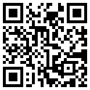

# Zarys fabuły: 

Na wydziale MiNI prof. Kostarczyk rozmieścił 10 różnych zagadek graficznych. 

Beta i Bit rozszyfrowali numery pokojów, przy których znajdują się te zagadki, na każdym piętrze są dwie.

Jak szybko jesteś w stanie je odnaleźć i rozwiązać?

## Zadanie 1:

Pracownicy wydziału MiNI zużywają sporo kredy. 

Poniższy wykres przedstawia ile kred zużyli różni znani matematycy w różnych miesiacach.

Zadanie: Znajdź miesiąc, w którym najwięcej kredy zużyła trójka: Hugon S., Stanisław U. i Wacław S.

http://betabit.wiki/app/pl/locations/1/tasks/6717/

## Zadanie 2:

Odczytaj z wykresu kiedy Bit przeczytał najwięcej podręcznika

http://betabit.wiki/app/pl/locations/1/tasks/5353/

## Zadanie 3:

Odczytaj z wykresu dane zakodowane przez ISOTYPE

http://betabit.wiki/app/pl/locations/1/tasks/1313/

## Zadanie 4:

Pomóż Bitowi wybrać serial na maraton filmowy

http://betabit.wiki/app/pl/locations/1/tasks/6911/

## Zadanie 5:

Pomóż Becie i Bitowi znaleźć najlepszy środek tranposrtu w Paryżu

http://betabit.wiki/app/pl/locations/1/tasks/9345/

