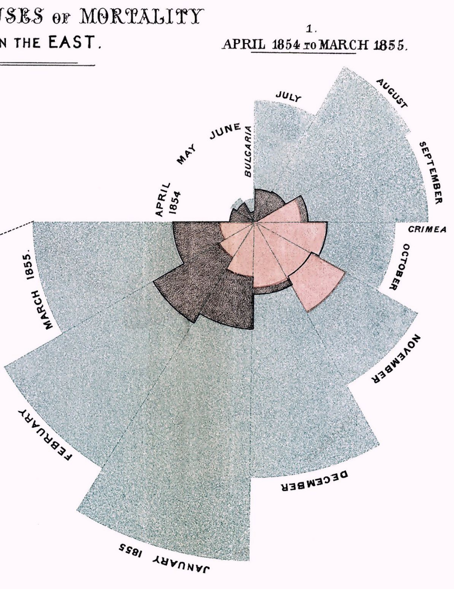

```{r setup, include=FALSE}
library(knitr)
opts_chunk$set(comment = NA, results = "asis", comment = NA, tidy = F)
```

## Wojna Krymska

Beta i Bit dotarli do wykresów opracowanych przez Florence Nightingale, przedstawiających główne powody zgonów żołnierzy na froncie wschodnim podczas wojny Krymskiej.

Kolorem niebieskim zaznaczono zgony wywołane chorobami, które dałoby się wyleczyć przy lepszej opiece. Kolorem czerwonym zgony z powodu ran wojennych a czarnym z innych przyczyn.

Odczytaj z tej mapy w którym miesiącu było najwięcej zgonów z przyczyny ran wojennych (najbardziej krwawe walki). Wynik, nazwę miesiąca, możesz podać w języku polskim lub angielskim.


.

Część lewa:

.


.

Część prawa:

.




