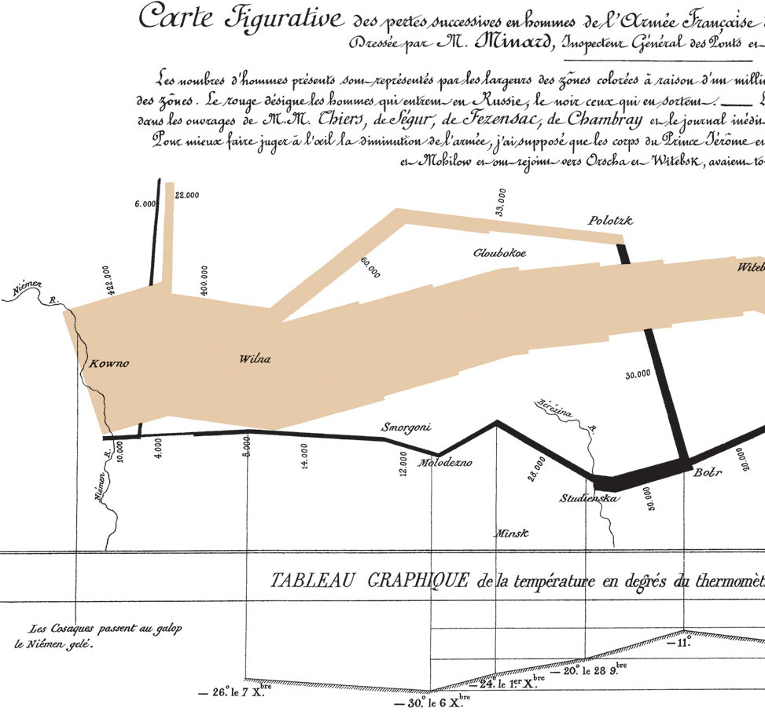
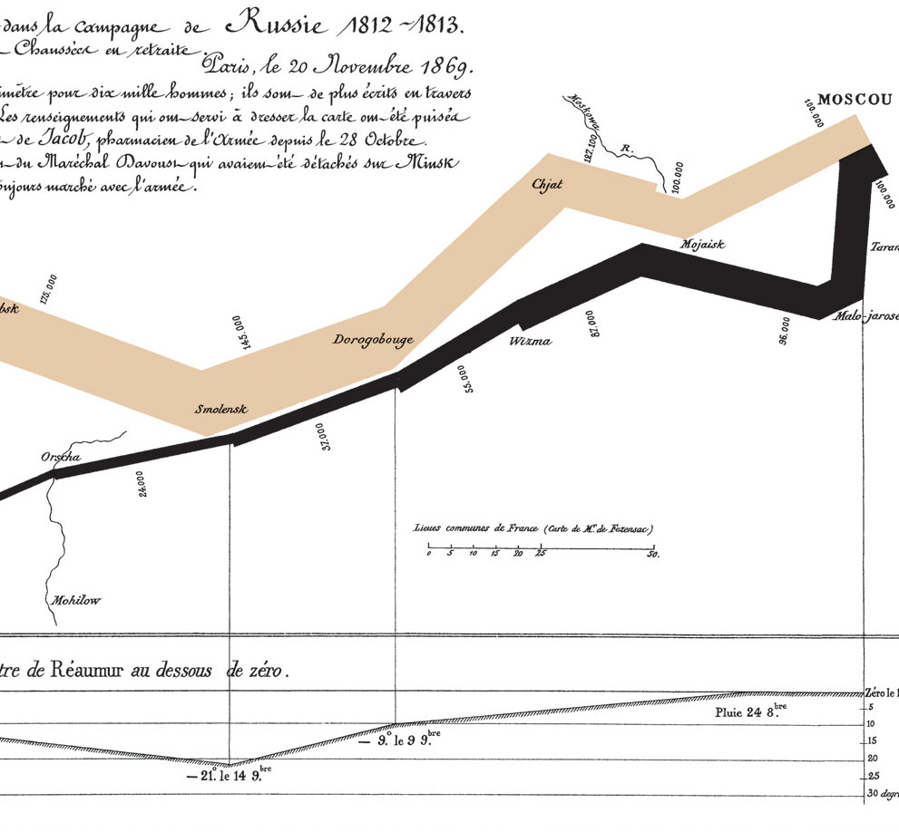

```{r setup, include=FALSE}
library(knitr)
opts_chunk$set(comment = NA, results = "asis", comment = NA, tidy = F)
```

## Wielki marsz

Wujek Bety i Bita interesuje się historią wojen napoleońskich. W dużym pokoju ma na ścianie powieszoną wielką mapę wykonaną przez Charlesa Minarda, opisującą losy armii Napoleońskiej w kampanii na Rosję.

Z mapy tej odczytać można kierunek marszu wojsk, liczebność armii w określonych punktach, temperaturę z którą musieli zmierzyć się żołnierze.

Odczytaj z tej mapy jak liczna była armia Napoleońska wchodząca do Wilna podczas ataku i jak liczebna była ta armia która weszła do Wilna podczas odwrotu.

Jako odpowiedź podaj ile razy liczebność armii Napoleońskiej zmalała gdy porównać wojska wchodzące do Wilna podczas ataku odwrotu względem armii, która wracała podczas odwrotu.


.

Część lewa:

.



.

Część prawa:

.



