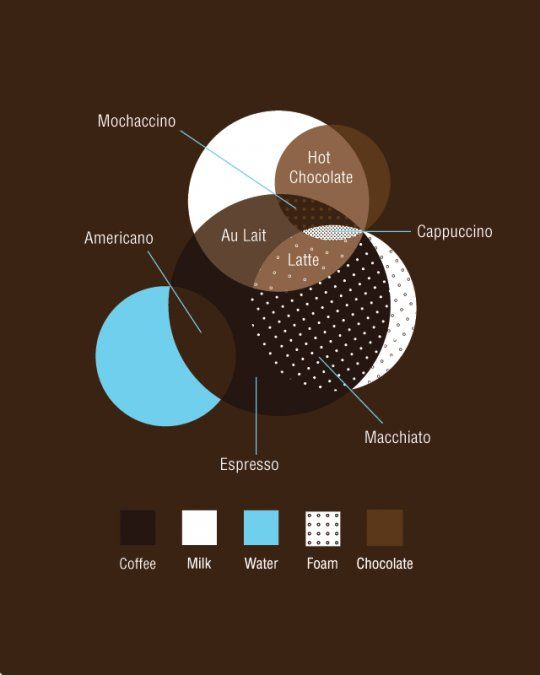

```{r setup, include=FALSE}
library(knitr)
opts_chunk$set(comment = NA, results = "asis", comment = NA, 
							 tidy = F, echo = FALSE, warning = FALSE, message = FALSE, error = FALSE)
```

```{r}
cat('<br>')
```	


**Zadanie:** Czy jesteś w stanie z poniższego diagramu wypisać w formacie `składnik1, składnik2, ...` kolejne składniki kawy **Latte** malejąco w zależności od stopnia zawartości? 



Beta starała się zapamiętać składniki różnych rodzajów kaw, tak by móc pomagać mamie 
parzyć ten napój w trakcie przyjęć rodzinnych. 

Powyższy diagram to [Diagram Venna](https://pl.wikipedia.org/wiki/Diagram_Venna) i służy ilustrowaniu zależności między zbiorami.

Więcej ciekawych infografik (o kawie też) można znaleźć [tutaj](https://www.pinterest.com/pin/485966616013252980/).