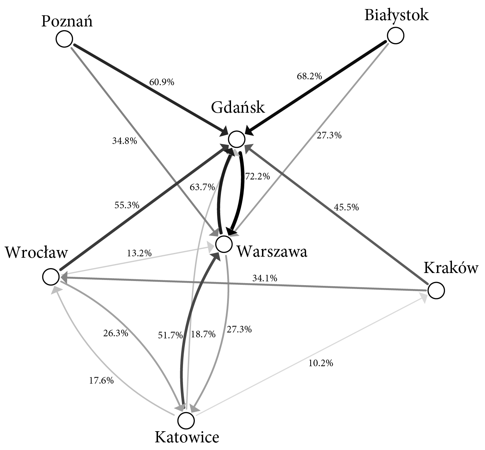

```{r setup, include=FALSE}
library(knitr)
opts_chunk$set(comment = NA, results = "asis", comment = NA, tidy = F)
```

## Paczka

Organizacja Z przechowuje cenne dane na laptopie, który jest nieustannie w ruchu.
Trasa po której ten laptop się przemieszcza nie jest nigdzie zapisana i kolejne stacje są wybierane w sposób losowy.

Beta i Bit śledzą sygnały o tym skąd laptop łączył się do sieci, dzięki czemu byli w stanie zbudować mapę opisującą z jakim prawdopodobieństwem laptop przemieści się z miasta X do miasta Y.

Wiedzą też, że ostatnio laptop łączył się z siecią z Katowic. Odczytaj z poniższego wykresy trzy najbardziej prawdopodobne kolejne stacje oraz podaj ich nazwy rozdzielane przecinkami. 
Odpowiedź podaj w formacie `Miasto1, Miasto2, Miasto3`. Wielkość liter nie ma znaczenia.

.


